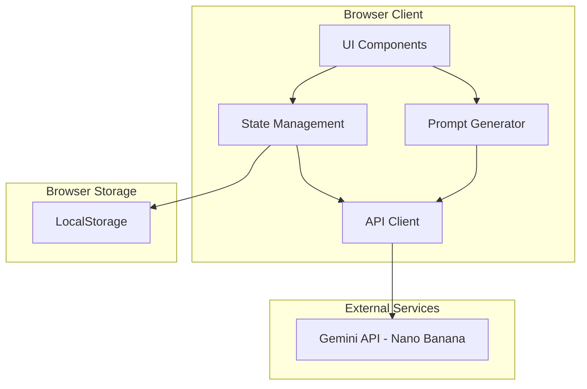
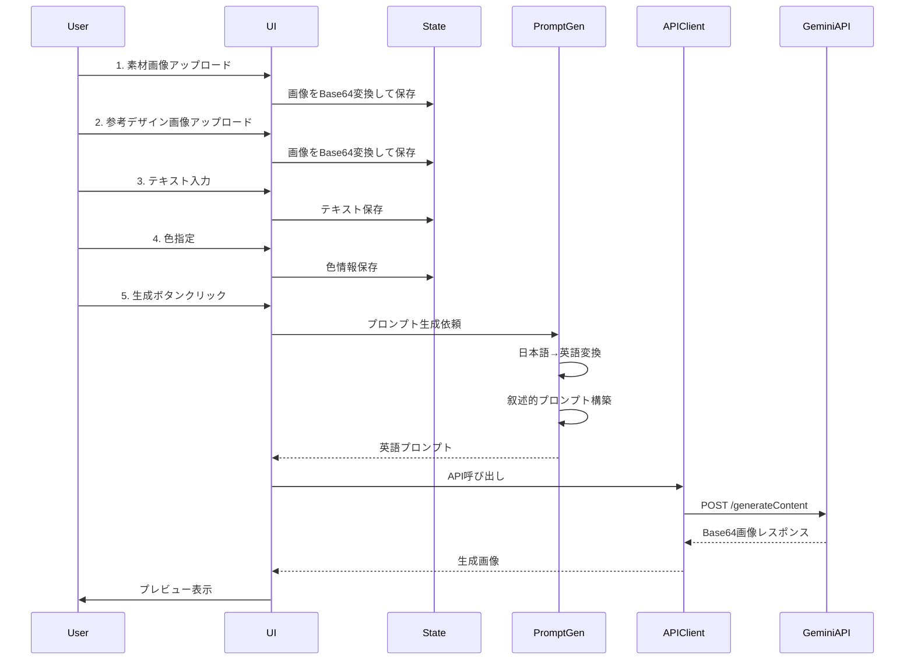
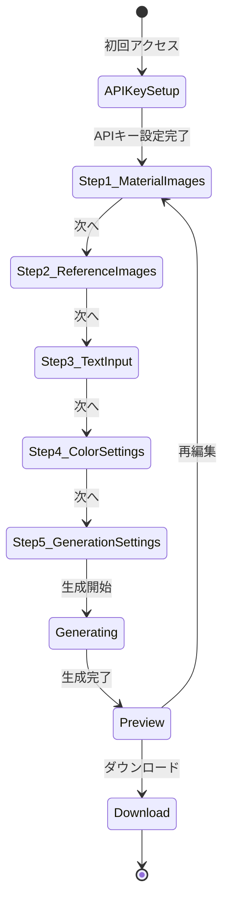
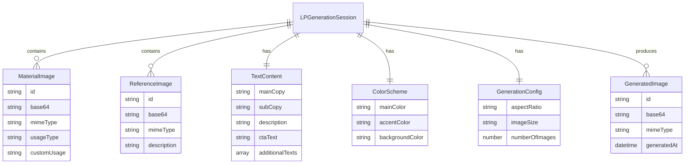

# Design Document: LP Generator

## Overview

**Purpose**: 本機能は、Nano Banana API（Gemini 3.0 Pro）を活用し、ユーザーが素材画像、参考デザイン、テキスト、色指定を入力するだけで、縦長LP（9:16）のデザイン画像を自動生成するWebアプリケーションを提供する。LP画像は1枚ずつNano Banana APIを通じて生成される。

**Users**: LP制作担当者、マーケター、デザイナーが、迅速にLPのデザインドラフトを作成するワークフローで利用する。

**Impact**: 従来のLP制作における初期デザイン工程を大幅に短縮し、アイデア検証の高速化を実現する。

### Goals
- ユーザーが直感的にLP素材を入力できるUI
- Nano Banana APIを活用した高品質な縦長LP画像生成
- 素材画像と参考デザイン画像の明確な区別による意図の正確な伝達
- パディング（余白）を最小限に抑えたLP画像の出力

### Non-Goals
- HTMLコードの自動生成（画像生成のみ）
- バックエンドサーバーの構築（クライアントサイド完結）
- マルチユーザー認証・課金システム（ユーザー自身のAPIキー使用）
- 生成画像の自動分割・セクション化（将来検討）

## Architecture

### Architecture Pattern & Boundary Map



**Architecture Integration**:
- **Selected pattern**: クライアントサイドSPA（Single Page Application）
- **Domain boundaries**: UI層、State管理層、API連携層の3層構造
- **New components rationale**: プロンプト生成ロジックをPromptGeneratorとして分離し、再利用性を確保
- **Steering compliance**: シンプルさを優先し、サーバーレス構成で初期MVPを実現

### Technology Stack

| Layer | Choice / Version | Role in Feature | Notes |
|-------|------------------|-----------------|-------|
| Frontend | Next.js 14+ / React 18 | UIフレームワーク、App Router | TypeScript使用 |
| Styling | Tailwind CSS 3.4+ | スタイリング | shadcn/uiと組み合わせ |
| UI Components | shadcn/ui | 高品質UIコンポーネント | Radix UIベース |
| State Management | Zustand 4+ | クライアント状態管理 | 軽量、シンプル |
| Form | React Hook Form 7+ | フォーム管理 | Zodでバリデーション |
| API Client | fetch API | Gemini API呼び出し | Base64画像処理 |
| ZIP | JSZip 3+ | 一括ダウンロード | クライアントサイド |
| Storage | localStorage | APIキー保存 | 暗号化保存 |

## System Flows

### LP生成フロー



### ウィザードフロー



## Requirements Traceability

| Requirement | Summary | Components | Interfaces | Flows |
|-------------|---------|------------|------------|-------|
| 1.1-1.5 | 画像アップロード | ImageUploader, ImagePreview | ImageUploadService | Step1, Step2 |
| 2.1-2.5 | テキスト入力 | TextInputForm | TextInputState | Step3 |
| 3.1-3.4 | 画像使用方法指定 | ImageUsageSelector | ImageUsageState | Step1 |
| 4.1-4.5 | 色指定 | ColorPicker, ColorExtractor | ColorState | Step4 |
| 5.1-5.4 | 生成設定 | GenerationSettings | GenerationConfigState | Step5 |
| 6.1-6.6 | プロンプト生成 | PromptGenerator | PromptService | Generating |
| 7.1-7.6 | API連携 | GeminiAPIClient | GeminiAPIService | Generating |
| 8.1-8.5 | 結果表示・DL | ResultPreview, DownloadManager | ResultState | Preview, Download |
| 9.1-9.5 | APIキー管理 | APIKeySettings | APIKeyService | APIKeySetup |
| 10.1-10.5 | UI/UX | WizardContainer,各Stepコンポーネント | WizardState | 全体 |

## Components and Interfaces

| Component | Domain/Layer | Intent | Req Coverage | Key Dependencies | Contracts |
|-----------|--------------|--------|--------------|------------------|-----------|
| WizardContainer | UI | ウィザードフロー制御 | 10.1-10.5 | Zustand (P0) | State |
| ImageUploader | UI | 画像アップロード処理 | 1.1-1.5 | react-dropzone (P1) | Service |
| ImageUsageSelector | UI | 画像使用方法の選択 | 3.1-3.4 | - | State |
| TextInputForm | UI | テキスト入力フォーム | 2.1-2.5 | React Hook Form (P0) | State |
| ColorPicker | UI | 色選択UI | 4.1-4.3 | react-colorful (P1) | State |
| GenerationSettings | UI | 生成設定UI | 5.1-5.4 | - | State |
| ResultPreview | UI | 生成結果プレビュー | 8.1-8.2 | - | State |
| PromptGenerator | Logic | プロンプト構築 | 6.1-6.6 | - | Service |
| GeminiAPIClient | Integration | API呼び出し | 7.1-7.6 | fetch (P0) | Service, API |
| DownloadManager | Logic | 画像ダウンロード | 8.3-8.5 | JSZip (P1) | Service |
| APIKeyManager | Logic | APIキー管理 | 9.1-9.5 | - | Service |

### UI Layer

#### WizardContainer

| Field | Detail |
|-------|--------|
| Intent | ウィザード形式の画面遷移とステップ管理を担当 |
| Requirements | 10.1, 10.2, 10.4 |

**Responsibilities & Constraints**
- ウィザードのステップ状態管理
- 各ステップ間のデータ引き継ぎ
- 戻る/進むナビゲーション制御

**Dependencies**
- Inbound: 各Stepコンポーネント — 子コンポーネント (P0)
- Outbound: Zustand Store — 状態管理 (P0)

**Contracts**: State [x]

##### State Management
```typescript
interface WizardState {
  currentStep: number;
  steps: StepConfig[];
  canProceed: boolean;
  canGoBack: boolean;
  goToStep: (step: number) => void;
  nextStep: () => void;
  prevStep: () => void;
}

interface StepConfig {
  id: string;
  title: string;
  description: string;
  isComplete: boolean;
}
```

#### ImageUploader

| Field | Detail |
|-------|--------|
| Intent | ドラッグ&ドロップと選択による画像アップロード |
| Requirements | 1.1, 1.2, 1.3, 1.5, 10.3 |

**Responsibilities & Constraints**
- 画像ファイルのドラッグ&ドロップ受付
- ファイル選択ダイアログ
- Base64エンコード変換
- 最大枚数制限の適用

**Dependencies**
- Inbound: WizardContainer — 親コンポーネント (P0)
- External: react-dropzone — DnDライブラリ (P1)

**Contracts**: Service [x]

##### Service Interface
```typescript
interface ImageUploadService {
  uploadImages(files: File[], type: 'material' | 'reference'): Promise<UploadedImage[]>;
  removeImage(imageId: string): void;
  getBase64(file: File): Promise<string>;
}

interface UploadedImage {
  id: string;
  file: File;
  base64: string;
  type: 'material' | 'reference';
  usage?: ImageUsageType;
  previewUrl: string;
}

type ImageUsageType =
  | 'main-visual'
  | 'background'
  | 'icon'
  | 'product'
  | 'person'
  | 'auto'
  | 'custom';
```

### Logic Layer

#### PromptGenerator

| Field | Detail |
|-------|--------|
| Intent | ユーザー入力から最適化された英語プロンプトを生成 |
| Requirements | 6.1, 6.2, 6.3, 6.4, 6.5, 6.6 |

**Responsibilities & Constraints**
- 日本語入力の英語変換
- 叙述的プロンプトの構築
- 素材画像使用方法の反映
- 色指定の反映
- パディング最小化指示の組み込み

**Dependencies**
- Inbound: UI Components — プロンプト生成依頼 (P0)
- Outbound: GeminiAPIClient — テキスト生成API（翻訳用） (P1)

**Contracts**: Service [x]

##### Service Interface
```typescript
interface PromptService {
  generatePrompt(input: PromptInput): Promise<GeneratedPrompt>;
  translateToEnglish(text: string): Promise<string>;
}

interface PromptInput {
  mainCopy: string;
  subCopy: string;
  description: string;
  ctaText: string;
  additionalTexts: string[];
  materialImages: MaterialImageInput[];
  referenceImages: ReferenceImageInput[];
  colors: ColorInput;
}

interface MaterialImageInput {
  base64: string;
  usage: ImageUsageType;
  customUsage?: string;
}

interface ReferenceImageInput {
  base64: string;
  description?: string;
}

interface ColorInput {
  mainColor?: string;
  accentColor?: string;
  backgroundColor?: string;
  extractFromReference?: boolean;
}

interface GeneratedPrompt {
  textPrompt: string;
  images: { base64: string; role: string }[];
}
```

**Implementation Notes**
- プロンプトテンプレート:
  ```
  Create a landing page design image in 9:16 vertical format.

  [Scene Description]
  Design a professional landing page for [product/service].
  The main visual should feature [material image usage].

  [Text Elements]
  Main headline: "[translated main copy]"
  Sub headline: "[translated sub copy]"
  CTA button: "[translated CTA]"

  [Color Scheme]
  Primary color: [main color]
  Accent color: [accent color]
  Background: [background color]

  [Style Reference]
  Follow the visual style, layout composition, and aesthetic
  of the provided reference images.

  [Technical Requirements]
  - Fill the entire canvas with no padding or margins
  - Edge-to-edge design without empty borders
  - Professional, modern landing page layout
  ```

#### GeminiAPIClient

| Field | Detail |
|-------|--------|
| Intent | Nano Banana Pro API（gemini-3-pro-image-preview）との通信 |
| Requirements | 7.1, 7.2, 7.3, 7.4, 7.5, 7.6 |

**Responsibilities & Constraints**
- API認証（ユーザー提供のAPIキー使用）
- リクエスト構築（Base64画像、設定パラメータ）
- レスポンス解析（Base64画像デコード）
- エラーハンドリング
- **マルチターン会話による整合性維持**（thought_signature の受け渡し）

**Dependencies**
- Inbound: PromptGenerator — API呼び出し依頼 (P0)
- External: Gemini API — 画像生成エンドポイント (P0)

**Contracts**: Service [x], API [x]

##### Service Interface
```typescript
interface GeminiAPIService {
  generateImage(request: GenerateImageRequest): Promise<GenerateImageResponse>;
  generateMultipleImages(request: GenerateImageRequest, count: number): Promise<GenerateImageResponse[]>;
  validateAPIKey(apiKey: string): Promise<boolean>;
}

interface GenerateImageRequest {
  apiKey: string;
  model: 'gemini-3-pro-image-preview';  // Nano Banana Pro
  prompt: string;
  images: Base64Image[];
  config: ImageGenerationConfig;
  // マルチターン会話で整合性維持
  conversationHistory?: ConversationTurn[];
  thoughtSignature?: string;
}

interface Base64Image {
  mimeType: string;
  data: string;
}

interface ImageGenerationConfig {
  aspectRatio: '9:16';
  imageSize: '1K' | '2K' | '4K';
  // LP画像は1枚ずつNano Banana APIで生成（複数枚の場合は順次リクエスト）
  numberOfImages: 1;
}

interface GenerateImageResponse {
  images: GeneratedImage[];
  textResponse?: string;
  // 次回リクエストに渡す整合性維持用署名
  thoughtSignature?: string;
}

interface GeneratedImage {
  id: string;
  base64: string;
  mimeType: string;
}

// マルチターン会話の履歴（整合性維持用）
interface ConversationTurn {
  role: 'user' | 'model';
  parts: (TextPart | ImagePart)[];
  thoughtSignature?: string;
}

interface TextPart {
  text: string;
}

interface ImagePart {
  inlineData: {
    mimeType: string;
    data: string;
  };
}
```

##### API Contract
| Method | Endpoint | Request | Response | Errors |
|--------|----------|---------|----------|--------|
| POST | https://generativelanguage.googleapis.com/v1beta/models/gemini-3-pro-image-preview:generateContent | GenerateContentRequest | GenerateContentResponse | 400, 401, 429, 500 |

```typescript
// Gemini API Request Format (Nano Banana Pro)
interface GenerateContentRequest {
  contents: {
    role: 'user' | 'model';
    parts: (TextPart | ImagePart)[];
  }[];
  generationConfig: {
    responseMimeType: 'image/png';
    responseModalities: ['TEXT', 'IMAGE'];
    imageConfig: {
      aspectRatio: '9:16';
      imageSize: '1K' | '2K' | '4K';
    };
  };
  safetySettings?: SafetySetting[];
}

// レスポンス（thought_signature含む）
interface GenerateContentResponse {
  candidates: {
    content: {
      parts: (TextPart | ImagePart)[];
    };
    thoughtSignature?: string;  // 次回リクエストに必須
  }[];
}
```

##### LP画像サイズ仕様
| サイズ設定 | 解像度 | 用途 |
|-----------|--------|------|
| 1K | 1080 × 1920 px | 標準（スマホ向け） |
| 2K | 1152 × 2048 px | 高解像度 |
| 4K | 2160 × 3840 px | 最高品質 |

##### 複数枚生成時の整合性維持
複数枚のLP画像を生成する場合、以下のフローで整合性を維持する：

```
1枚目生成:
  Request: { prompt, images, config }
  Response: { image1, thoughtSignature: "sig1" }

2枚目生成:
  Request: {
    prompt: "Continue with the same style...",
    images,
    config,
    conversationHistory: [prev_turn],
    thoughtSignature: "sig1"  // 前回の署名を渡す
  }
  Response: { image2, thoughtSignature: "sig2" }

3枚目以降も同様...
```

**プロンプトで整合性を強調**:
```
Generate the next LP section maintaining exact consistency with:
- Same color palette and gradients
- Same typography style and sizing
- Same visual treatment and effects
- Edge-to-edge design with no margins
- Seamless connection with previous section
```

#### DownloadManager

| Field | Detail |
|-------|--------|
| Intent | 生成画像のダウンロード処理 |
| Requirements | 8.3, 8.4 |

**Responsibilities & Constraints**
- 単一画像のPNGダウンロード
- 複数画像のZIP一括ダウンロード
- ファイル名の自動生成

**Dependencies**
- Inbound: ResultPreview — ダウンロード依頼 (P0)
- External: JSZip — ZIP生成 (P1)

**Contracts**: Service [x]

##### Service Interface
```typescript
interface DownloadService {
  downloadSingleImage(image: GeneratedImage, filename?: string): void;
  downloadAllAsZip(images: GeneratedImage[], zipFilename?: string): Promise<void>;
}
```

#### APIKeyManager

| Field | Detail |
|-------|--------|
| Intent | APIキーの安全な保存と取得 |
| Requirements | 9.1, 9.2, 9.3, 9.4, 9.5 |

**Responsibilities & Constraints**
- APIキーの暗号化保存（localStorage）
- APIキーの取得とマスク表示
- キーの有効性検証

**Dependencies**
- Outbound: localStorage — ブラウザストレージ (P0)
- Outbound: GeminiAPIClient — キー検証 (P1)

**Contracts**: Service [x]

##### Service Interface
```typescript
interface APIKeyService {
  saveAPIKey(apiKey: string): void;
  getAPIKey(): string | null;
  getMaskedAPIKey(): string;
  clearAPIKey(): void;
  isAPIKeySet(): boolean;
}
```

**Implementation Notes**
- 暗号化: Web Crypto API (AES-GCM) を使用
- 鍵導出: ブラウザフィンガープリントベースの固定鍵（簡易保護）
- 将来的にはより安全な方法を検討

## Data Models

### Domain Model



### Logical Data Model

**LPGenerationSession**: アプリケーションの中心エンティティ。1回の生成セッションを表す。

**Structure Definition**:
- セッションは一時的（ブラウザセッション内のみ）
- 生成履歴はセッション内で保持
- APIキーのみlocalStorageに永続化

**Consistency & Integrity**:
- セッションデータはZustandストアで管理
- 画面遷移時もデータを維持
- ブラウザリロードでリセット（APIキー除く）

## Error Handling

### Error Strategy
- **Fail Fast**: 入力バリデーションで早期にエラー検出
- **Graceful Degradation**: API障害時はエラーメッセージ表示、リトライオプション提供
- **User Context**: 具体的なエラー原因と対処方法を表示

### Error Categories and Responses

**User Errors (4xx)**:
- 画像枚数超過 → 「素材画像は最大6枚までです」
- APIキー未設定 → 「APIキーを設定してください」
- 必須項目未入力 → フィールドハイライト + エラーメッセージ

**System Errors (5xx)**:
- API通信エラー → 「接続エラーが発生しました。再試行してください」
- 画像生成失敗 → 「画像生成に失敗しました。プロンプトを調整して再試行してください」

**API Specific Errors**:
- 401 Unauthorized → 「APIキーが無効です。正しいキーを入力してください」
- 429 Rate Limited → 「APIリクエスト制限に達しました。しばらく待ってから再試行してください」

### Monitoring
- ブラウザコンソールへのエラーログ出力
- 将来的には分析ツール（GA4等）でエラー追跡

## Testing Strategy

### Unit Tests
- PromptGenerator: プロンプト構築ロジック
- APIKeyManager: 暗号化/復号化
- DownloadManager: ファイル名生成
- ColorExtractor: 色抽出アルゴリズム（実装時）

### Integration Tests
- GeminiAPIClient: API呼び出しとレスポンス解析
- ImageUploader: ファイル処理とBase64変換
- WizardContainer: ステップ遷移とデータ永続化

### E2E Tests
- 完全なLP生成フロー（素材入力→生成→ダウンロード）
- エラーハンドリングフロー（APIキー未設定、API障害）
- レスポンシブデザイン（PC/タブレット/スマホ）

## Security Considerations

### APIキー保護
- ユーザー自身のAPIキーをクライアント側で使用
- localStorage保存時はAES-GCM暗号化
- キーは絶対にサーバーに送信しない

### 画像データ
- アップロード画像はメモリ/セッション内のみ保持
- 外部送信はGemini APIへのみ（ユーザーの明示的操作）
- ブラウザ終了時に自動削除

### CORS
- Gemini APIはCORS対応済み
- 追加のプロキシサーバー不要

## Performance & Scalability

### Target Metrics
- 画像アップロード: 即時プレビュー表示
- 画像生成: 10-30秒（API依存）
- UI操作: 60fps維持

### Optimization
- 画像プレビュー: URLオブジェクト使用で即時表示
- 大きな画像: クライアントサイドでリサイズしてからAPI送信
- 状態更新: Zustandの選択的サブスクリプション
